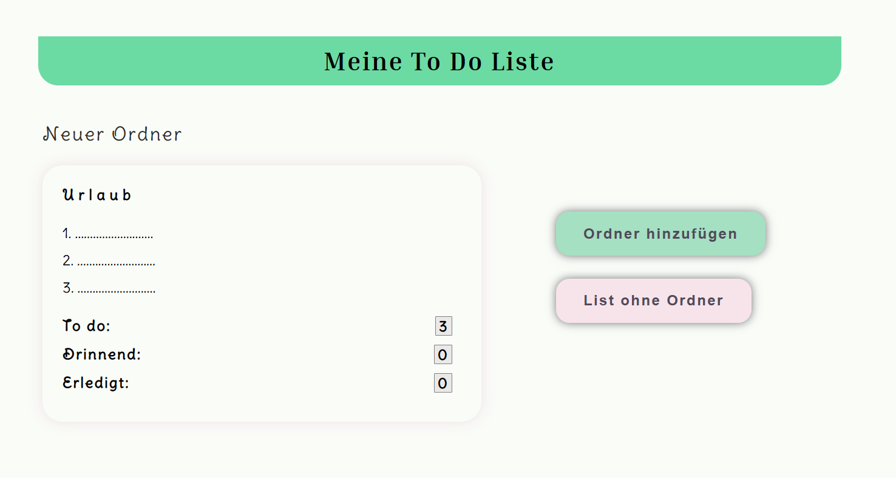

# To Do App 
Eine einfache To-Do-Anwendung zum Erstellen, Kategorisieren und Verwalten von Aufgaben.

## App hilft To Do Aufgaben erstellen, kategorisieren und markieren

**Technologien**
-HTML5
-CSS
-JavaScript(Vanilla)

**Funktionen**
- Aufgaben erstellen – mit oder ohne Kategorie (Ordner)
- Aufgaben mit Labels kennzeichnen (z. B. „Optional“, „Dringend“)
- Fälligkeitsdatum für Aufgaben festlegen
- Aufgaben bearbeiten, als erledigt markieren oder löschen
- Übersichtliche Darstellung der Aufgabenliste

[Link zu To Do App](https://smart-to-do-list-full.netlify.app/)

##Screenshot von Hauptseite:

_Autorin_
Jana Engenhorst